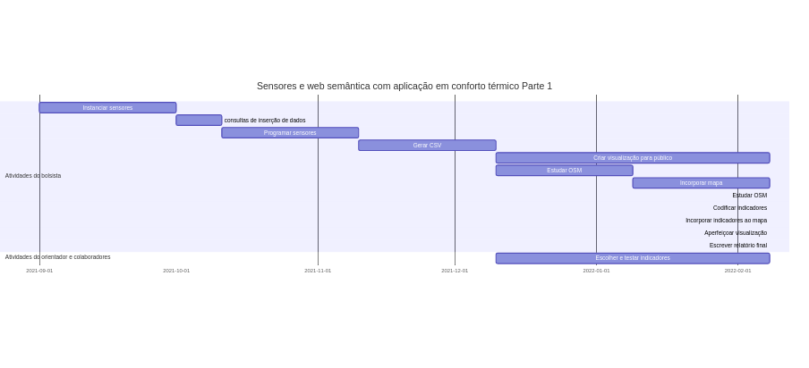
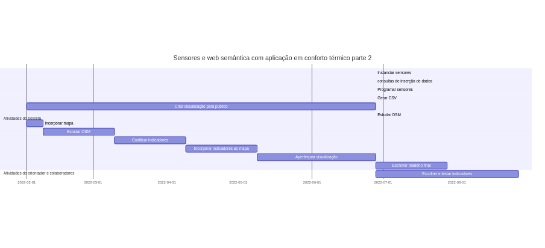
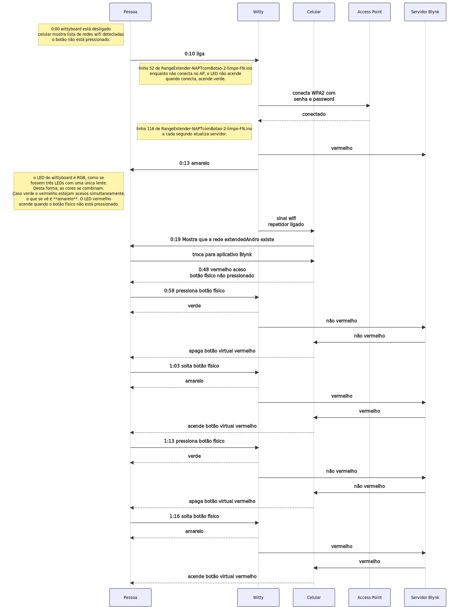

# Título

O texto não precisa ser longo, nem usar linguagem sofisticada/rebuscada.
No Github, toda seção (linha prefixada com um ou mais hashtags) é uma marca que pode ser referenciada. Como nem todo caracter pode ser usado em um link, caracteres acentuados, espaços, letras maiúsculas são trocados, como no exemplo abaixo: 

```
https://github.com/FNakano/modelo#resultados-e-indicadores-de-avalia%C3%A7%C3%A3o-resultados-dos-testes-dos-entreg%C3%A1veis---cada-resultado-como-uma-subse%C3%A7%C3%A3o-para-facilitar-links-para-o-resultado-espec%C3%ADfico---esta-parte-precisa-ser-bem-detalhada
```

1. É possível obter o link colocando a seção desejada no texto, atualizando o repositório (git add, git commit, git push), mostrando a página no navegador, passar o mouse por cima do título da seção, clicando com o botão da direita e clicando em copiar link. Depois colá-lo onde precisar;
2. Outra alternativa (extrema) é escrever os títulos das seções sem usar os caracteres que são trocados. Não é muito viável pois espaços e maiúsculas são trocados;

Soluções intermediárias - por exemplo lembrar que maiúsculas e espaços são trocados por minúsculas e traço, respectivamente, e encurtar o títulos das seções podem levar a resultados legíveis e que poupam tempo e esforço.

## Introdução (parte já foi feita na proposta)
### Contextualização (o que se sabe) e Motivação (por que se quer)  (desnecessário, se for o mesmo da proposta)
### Revisão Bibliográfica (informação que foi encontrada durante a execução)
#### Conceitos e Terminologia (glossário)
### Organização do relatório (links, please)
## Objetivos (os gerais foram escritos na proposta, os específicos podem ser acrescentados)
## Materiais e Métodos ( quais são os ingredientes e o que fazer com eles para chegar nos resultados - esta parte precisa ser bem detalhada)

Lista de materiais (porcas, parafusos, fios - elementos que, na quantidade utilizada, tem baixo impacto no valor final - baixo impacto < 1% por linha, podem ficar com valor e quantidade em branco):

| Nome | quantidade | preço | exemplo de site ofertando | link para foto do componente utilizado |
| --- | --- | --- | --- | --- |
| ESP32-WROOM | 1 | 52,50 | https://www.curtocircuito.com.br/catalog/product/view/id/1006/s/placa-doit-esp32-esp-wroom-32-wifi-bluetooth/ | 20210708_102001.jpg |

Lista de programas usados

| Nome | site do fornecedor | licença usada | valor pago |
| --- | --- | --- | --- |
| mermaid | https://mermaid-js.github.io/mermaid/#/ | gratuita | zero |


## Resultados e indicadores de avaliação (resultados dos testes dos entregáveis - cada resultado como uma subseção, para facilitar links para o resultado específico - esta parte precisa ser bem detalhada)

### Cronograma de atividades e entregáveis previstos  (ex. ferramenta: mermaid)

A idéia é dimensionar esforço e resultado para que possa ser feito durante a disciplina. Imprevistos acontecem, são aceitáveis até certo ponto. Neste caso, justificar, ajustar e seguir. Se chegar ao ponto em que só for possível cobrar cumprimento de cronograma, é porque todas as outras alternativas de orientação foram tentadas e não levaram ao efeito desejado.

Diagramas feitos usando [mermaid live editor](https://mermaid-js.github.io/mermaid-live-editor).






Cronograma da proposta de projeto PUB-2021: Sensores e web semântica com aplicação em conforto térmico.

```
gantt
    title Sensores e web semântica com aplicação em conforto térmico Parte 1
    dateFormat  YYYY-MM-DD
    section Atividades do bolsista
        Instanciar sensores           :a1, 2021-09-01, 30d
        consultas de inserção de dados     :a2, after a1  , 10d
        Programar sensores :a3, after a2, 30d
        Gerar CSV          :a4, after a3, 30d
        Criar visualização para público :a6, after a4, 60d
        Estudar OSM :a7, after a4, 30d
        Incorporar mapa :a8, after a7, 30d
        Estudar OSM :a9
        Codificar indicadores :a10
        Incorporar indicadores ao mapa :a11
        Aperfeiçoar visualização : a12
        Escrever relatório final : 
    section Atividades do orientador e colaboradores
        Escolher e testar indicadores :a5, after a4, 60d

```


```
gantt
    title Sensores e web semântica com aplicação em conforto térmico parte 2
    dateFormat  YYYY-MM-DD
    section Atividades do bolsista
        Instanciar sensores           :a1
        consultas de inserção de dados     :a2
        Programar sensores :a3
        Gerar CSV          :a4
        Criar visualização para público :a6, 2022-02-01, 147d
        Estudar OSM :a7
        Incorporar mapa :a8, 2022-02-01, 7d
        Estudar OSM :a9, after a8, 30d
        Codificar indicadores :a10, after a9, 30d
        Incorporar indicadores ao mapa :a11, after a10, 30d
        Aperfeiçoar visualização : a12, after a11, 50d
        Escrever relatório final :after a6, 30d
    section Atividades do orientador e colaboradores
        Escolher e testar indicadores :a5, after a4, 60d

```


### Entregáveis previstos (há informação adicional, dependendo do tipo de entregável)

**Sugestão**: toda atividade ter um resultado entregável. (Isto atrasa o desenvolvimento mas obriga a documentar e documentar é essencial)

- Diagramas de ligação (esquemáticos), ou lista de ligações;
- tutoriais de montagem;
   - Se tiver API, documentação;
- tutoriais de uso;
   - exemplos de operação;
   - Diagramas de comunicação (ex. ferramenta: mermaid);

### Entregáveis não previstos (soluções para problemas colaterais)



Fonte do diagrama: https://github.com/FNakano/CFA/tree/master/projetos/ExtensorComBotao

```
sequenceDiagram
  participant Pessoa
  participant Witty
  participant Celular
  participant Access Point
  Note left of Pessoa: 0:00 wittyboard está desligado<br />celular mostra lista de redes wifi detectadas<br />o botão não está pressionado.
  Pessoa->>Witty: 0:10 liga
  Note left of Witty: linha 52 de RangeExtender-NAPTcomBotao-2-limpo-FN.ino<br /> enquanto não conecta no AP, o LED não acende<br />quando conecta, acende verde.
  Witty->>Access Point: conecta WPA2 com<br /> senha e password
  Access Point-->>Witty: conectado
  Note left of Witty: linha 116 de RangeExtender-NAPTcomBotao-2-limpo-FN.ino<br />a cada segundo atualiza servidor.
  Witty->>Servidor Blynk: vermelho
  Witty->>Pessoa: 0:13 amarelo
  Note left of Pessoa: o LED do wittyboard é RGB, como se<br />fossem três LEDs com uma única lente.<br />Desta forma, as cores se combinam.<br />Caso verde e vermelho estejam acesos simultaneamente,<br />o que se vê é **amarelo**. O LED vermelho<br />acende quando o botão físico não está pressionado. 
  Witty->>Celular: sinal wifi<br />repetidor ligado
  Celular->>Pessoa: 0:19 Mostra que a rede extendedAndro existe
  Pessoa->>Celular: troca para aplicativo Blynk
  Celular-->>Pessoa: 0:48 vermelho aceso<br /> botão físico não pressionado
  Pessoa->>Witty: 0:58 pressiona botão físico
  Witty-->>Pessoa: verde
  Witty->>Servidor Blynk: não vermelho
  Servidor Blynk->>Celular: não vermelho
  Celular-->>Pessoa: apaga botão virtual vermelho
  Pessoa->>Witty: 1:03 solta botão físico
  Witty-->>Pessoa: amarelo
  Witty->>Servidor Blynk: vermelho
  Servidor Blynk->>Celular: vermelho
  Celular-->>Pessoa: acende botão virtual vermelho
  Pessoa->>Witty: 1:13 pressiona botão físico
  Witty-->>Pessoa: verde
  Witty->>Servidor Blynk: não vermelho
  Servidor Blynk->>Celular: não vermelho
  Celular-->>Pessoa: apaga botão virtual vermelho
  Pessoa->>Witty: 1:16 solta botão físico
  Witty-->>Pessoa: amarelo
  Witty->>Servidor Blynk: vermelho
  Servidor Blynk->>Celular: vermelho
  Celular-->>Pessoa: acende botão virtual vermelho
```


## Discussão e Conclusão
### Consequências lógicas dos resultados (resultados deduzidos);
### Dificuldades que levaram às soluções colaterais
### Especulações/questionamentos a partir dos resultados (resultados induzidos);
### Desdobramentos possíveis (próximos passos, possibilidades, *spin-offs*);
## Referências

[Proposta](proposta.md)

[Diário](diario.md)


